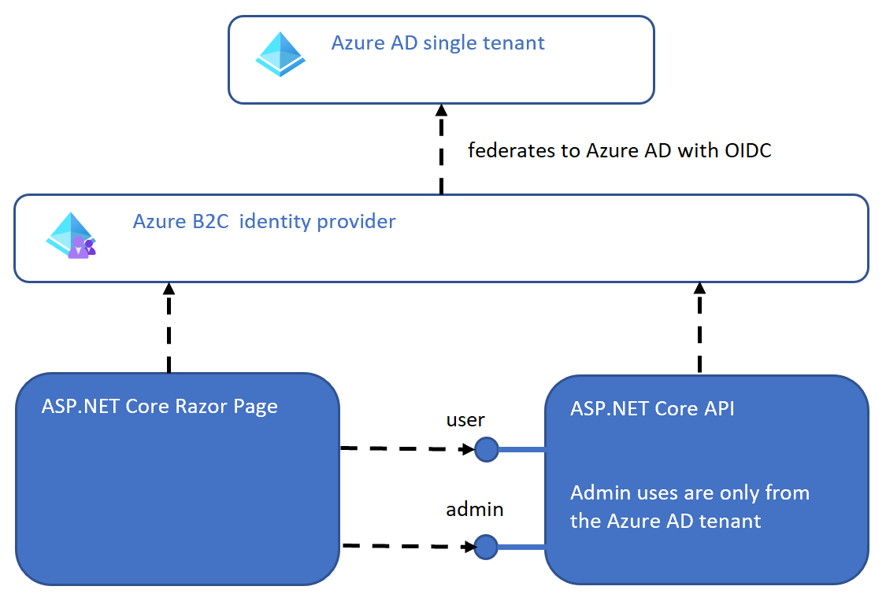

# ASP.NET Core Azure B2C, Azure AD

Securing ASP.NET Core Razor, Web APIs with Azure B2C external and Azure AD internal identities

https://damienbod.com/2021/07/26/securing-asp-net-core-razor-pages-web-apis-with-azure-b2c-external-and-azure-ad-internal-identities/

# Links

https://docs.microsoft.com/en-us/azure/active-directory-b2c/overview

https://docs.microsoft.com/en-us/azure/active-directory-b2c/identity-provider-azure-ad-single-tenant

https://github.com/AzureAD/microsoft-identity-web

https://docs.microsoft.com/en-us/azure/active-directory/develop/microsoft-identity-web

https://docs.microsoft.com/en-us/azure/active-directory-b2c/identity-provider-local

https://docs.microsoft.com/en-us/azure/active-directory/

https://docs.microsoft.com/en-us/aspnet/core/security/authentication/azure-ad-b2c

https://github.com/azure-ad-b2c/azureadb2ccommunity.io

https://github.com/azure-ad-b2c/samples
